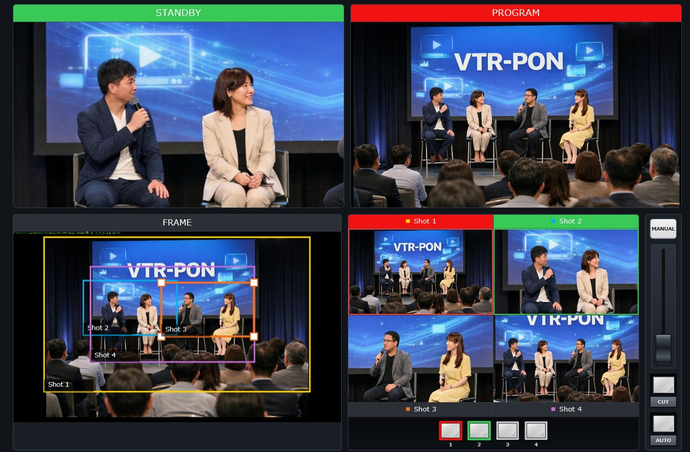

# 4K-UVC-PON

4K-UVC-PON is a browser-based prototype of a pseudo multi-camera switcher.

Using a single 4K UVC camera input, it creates multiple virtual shots and lets you switch them with a switcher-like interface including STANDBY, PROGRAM, CUT, AUTO, and T-bar operation.

## Screenshot

## Features

- UVC camera input preview
- STANDBY / PROGRAM dual monitoring
- 4 virtual shots
- Drag to move shot frames
- CUT / AUTO / T-bar switching
- Separate PROGRAM output window
- Browser-based prototype UI

## Files

- `index.html` - Main application
- `manual.html` - Manual / usage guide
- `switcher.css` - UI styles
- `switcher.js` - Main switching logic

## How to use

1. Open `index.html` in a supported browser.
2. Allow camera access.
3. Select a shot for STANDBY.
4. Switch with CUT, AUTO, or T-bar.

## Notes

- Camera permission is required.
- Behavior may differ depending on browser and environment.
- This is a prototype and may not include all planned features.

## License

MIT